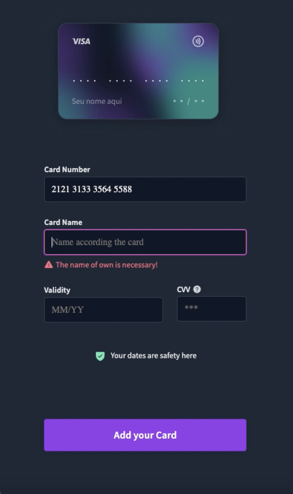
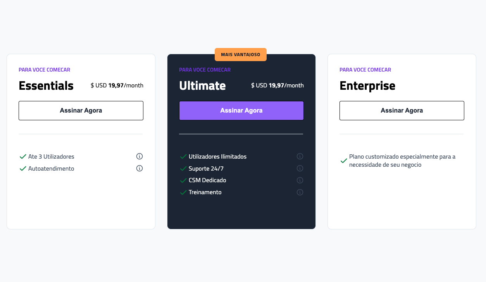

#PROJECTO BORA CODAR DA ROCKETSEAT

Boracodar - projecto semanal rockectseat #boraCodar 💻

Aqui acompanho o projecto, apredendo cada semana, html, css, javascript ...

# #boraCodar

    Projetos #boraCodar da Rocketseat  
    <a href="https://boracodar.dev">Acesse o desafio desta semana clicando aqui</a> 
     <table>
    <thead>
        <tr>
            <th align="center">
                 
                

                    <small>#</small>
                

            </th>
            <th align="center">
                 
                
 
                    <small>
                        NAME
                    </small>
                

            </th>
            <th align="left">
                
                
 
                    <small>
                    RELEASE DATE
                    </small>
                

            </th>
            <th align="center">
                
                
 
                    <small>
                    PREVIEW
                    </small>
                

            </th>
            <th align="center">
                
                
 
                    <small>
                    DEMO
                    </small>
                

            </th>
        </tr>
    </thead>
    <tbody>
        <tr>
            <td>05</td>
            <td><a href="05">Calculadora</a></td>
            <td>08/02/23</td>
            <td align="center"></td>
            <td></td>
        </tr>
        <tr>
            <td>13</td>
            <td><a href="13">Um formulário de cartão</a></td>
            <td>05/04/23</td>
            <td align="center" ></td>
            <td>)</td>
        </tr>
        <tr>
            <td>14</td>
            <td><a href="14">Um componente de upload</a></td>
            <td>12/04/23</td>
            <td align="center" ></td>
            <td></td>
        </tr>
        <tr>
            <td>15</td>
            <td><a href="15">Pricing Table</a></td>
            <td>17/04/23</td>
            <td align="center" ></td>
            <td></td>
        </tr>
    </tbody>
</table>

## About Me

## Hello Everybody, I am Fernando Piedade Software Developer 👌 👋

